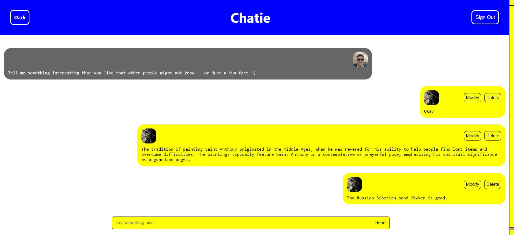

<h2 align="center">Deploy link:</h2>

@[Chatie](https://chat-fullstack-steel.vercel.app/)

```
https://chat-fullstack-steel.vercel.app/
```


<h1 align="center" style="color: #805ad5; font-weight: bold;">Chatie</h1>
<p align="center">
Topics: 
<a href="#tech">Technolgies</a> |
<a href="#how">How was made</a> |
<a href="#obj">Objective</a>
</p>


<p align="center">
<b>A site for chatting with other people through a friendly and fun interface.</b>
</p>


<p align="center">
  <p align="center">
    
  </p>
</p>


<h2 id="tech" align="center">Technologies</h2>
HTML, CSS, JavaScript and React.

### DB:
Firebase.


<h2 id="how" align="center">How was made</h2>
I was inspired by common things in the interface of other e-commerces and aimed to standardize the code for easy reading through order patterns, also using naming methods for functions, classes and files.
</br>
I made a class in the API fetch trying to make it easier to use later, but I didn't follow SOLID's Single Responsibility Principle, although it really made it easier.
</br>
All elements was responsive since from creation for all different devices.


<h2 id="obj" align="center">Objective</h2>
Understand how different technologies (JS, Git, etc.) and concepts are combined into the same application.
